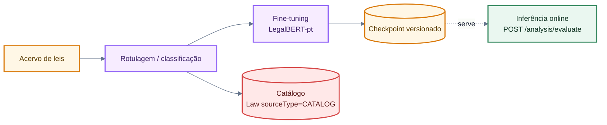
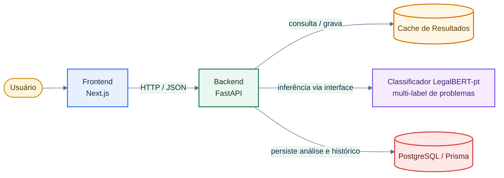
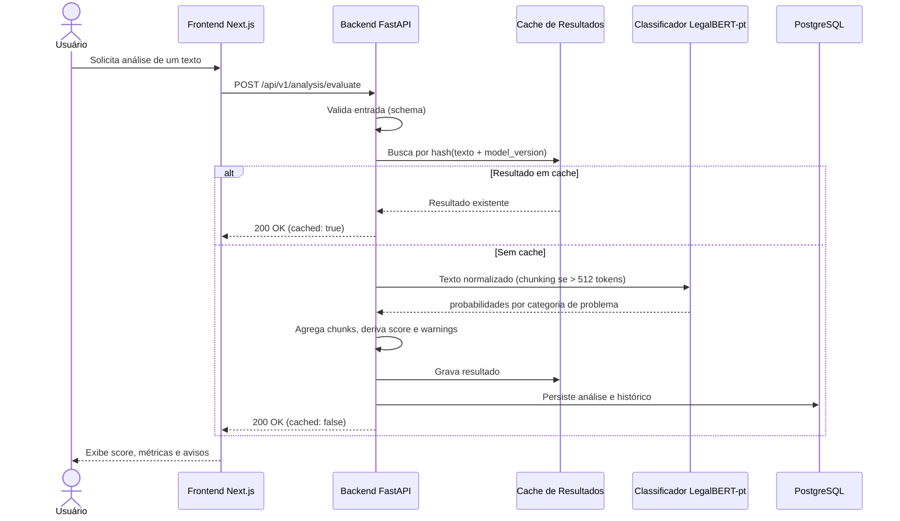

# Arquitetura de Integração IA → Backend

## Objetivo

Este documento define como a futura análise de IA do **CrivoAI** se conecta ao backend e ao frontend. Ele existe para reduzir a incerteza arquitetural apontada na issue #106: sem uma arquitetura clara de integração, fica difícil planejar sprints da R2, dividir tarefas e validar decisões de desempenho.

A página descreve componentes, fluxos de requisição e resposta, contratos (schemas), decisões de integração e os limites operacionais esperados. Ela complementa as [Métricas de Sucesso da IA](ai-success-metrics.md), que definem os critérios de qualidade e monitoramento, e a [Visão Geral da Arquitetura](index.md), que descreve a separação por camadas do projeto.

## Estado Atual

Na Release 1, a análise real de IA, o score real e o agente jurídico continuam **fora de escopo**. Os indicadores exibidos no protótipo são demonstrativos e não representam processamento real, conforme já registrado na spec de integração frontend-backend.

Este documento descreve a arquitetura **planejada para a R2 e versões futuras**. Nada aqui implica que o CrivoAI já possua modelo em produção, fila de processamento ou cache de resultados. O texto serve para orientar a implementação incremental e o planejamento de tarefas.

## Dois Fluxos de Classificação

A classificação acontece em dois momentos distintos, que usam o mesmo modelo mas têm caminhos e requisitos diferentes:

1. **Offline — construção do catálogo e treinamento.** Um acervo de leis é classificado/rotulado e usado para o fine-tuning do LegalBERT-pt. As leis classificadas são persistidas como **catálogo** (`Law.sourceType = CATALOG`), servindo ao mesmo tempo de base de treino e de conteúdo navegável. Roda em lote, **fora do caminho de requisição** do usuário.
2. **Online — classificação sob demanda.** Quando um usuário envia uma lei nova ou atualizada, o backend chama o modelo **já treinado** e classifica **na hora**, retornando o resultado e persistindo a análise. É o fluxo coberto pelos endpoints `/api/v1/analysis/*`.

| Aspecto | Fluxo offline (catálogo + treino) | Fluxo online (sob demanda) |
| --- | --- | --- |
| Disparo | Processo em lote do Squad | Requisição do usuário |
| Objetivo | Rotular acervo, treinar modelo, popular catálogo | Classificar lei nova/atualizada na hora |
| Latência | Não crítica | Sujeita aos alvos de 2 s / 5 s |
| Persistência | `Law` com `sourceType = CATALOG` + classificação | Análise da submissão (`USER_UPLOAD`) |
| Produz | Checkpoint versionado + catálogo classificado | Resposta de `POST /api/v1/analysis/evaluate` |



> O valor `CATALOG` do enum `LawSourceType` já existe no schema Prisma (`backend/prisma/schema.prisma`) e na migration inicial, mas **ainda não é populado** — hoje a API e o seed gravam apenas `USER_UPLOAD`. O catálogo de leis classificadas é, portanto, uma evolução já prevista no modelo de dados.

O treinamento em si (preparação do dataset, ciclo de fine-tuning, métricas de treino) é um tema de ciclo de vida de ML e fica fora do escopo desta página de integração; aqui interessam os **pontos de contato**: de onde vem o catálogo, qual checkpoint é servido e como o modelo treinado entra no fluxo online.

## Visão Geral da Integração (Fluxo Online)

A análise de IA é orquestrada pelo backend FastAPI. O frontend nunca chama o classificador diretamente: ele conversa apenas com o backend, que aplica regras de negócio, controla cache, registra logs e delega a inferência a um componente de IA isolado por trás de uma interface estável.

O modelo planejado é o **LegalBERT-pt**, um BERT (encoder Transformer) com fine-tuning em documentos jurídicos brasileiros, usado como **classificador multi-label de problemas** do texto legislativo. A escolha vem do estudo do Squad em [Agentes de IA e PLN](https://github.com/unb-mds/2026-1-Squad07/blob/main/estudos/sprint3/Estudo(Agentes%20de%20IA%20e%20PLN)%20-%20Agentes%20de%20IA%20e%20Processamento%20de%20Linguagem%20Natural.md). O modelo é **auto-hospedado e executado localmente** (não é uma API de terceiros), carregado uma única vez na inicialização e mantido em memória.



### Responsabilidades por Componente

| Componente | Responsabilidade |
| --- | --- |
| Frontend (Next.js) | Enviar o texto para o backend, exibir status, score, métricas e avisos. Nunca acessa o serviço de IA diretamente. |
| Backend (FastAPI) | Validar entrada, consultar e gravar cache, orquestrar a análise, registrar logs estruturados, persistir resultado e histórico, expor os endpoints versionados. |
| Classificador LegalBERT-pt | Receber texto normalizado (com chunking quando necessário), inferir as probabilidades de cada categoria de problema e devolvê-las. Fica atrás de uma interface estável (`AnalysisProvider`), o que permite trocar o modelo sem afetar o resto do sistema. |
| Cache de Resultados | Evitar reprocessar o mesmo texto com a mesma versão de modelo. |
| PostgreSQL / Prisma | Persistir o resultado de cada análise e o histórico por submissão. |

## Decisões Arquiteturais

### Integração local (modelo auto-hospedado) vs. externa (API de terceiros)

**Decisão:** o LegalBERT-pt é um modelo **auto-hospedado e executado localmente** (HuggingFace `transformers` + PyTorch), não uma API de terceiros. Ele fica atrás de uma interface (`AnalysisProvider`) definida no backend. A R2 começa com o modelo carregado **no próprio processo do backend** (`backend/app/services/analysis/`) e o sistema deve poder evoluir para um **serviço de inferência separado** sem mudar os contratos HTTP nem a camada de API.

**Por quê:** o modelo é leve o suficiente para fine-tuning sem supercomputador (o estudo do Squad indica ajuste de menos de 5% dos parâmetros), o que torna a execução local viável (RNF08) e mantém a separação de camadas (RNF04). Carregar no processo reduz a complexidade da primeira versão avaliável. A interface estável evita acoplar a API ao detalhe de inferência, permitindo isolar o modelo em um serviço próprio quando o peso de `torch`, o uso de GPU ou a necessidade de escalar a inferência justificarem.

| Critério | Carregado no backend (R2 inicial) | Serviço de inferência separado (evolução) |
| --- | --- | --- |
| Complexidade de deploy | Baixa, sobe junto com o backend | Maior, exige orquestração própria |
| Isolamento de dependências de ML (`torch`/GPU) | Fraco | Forte |
| Escala independente da inferência | Não | Sim |
| Execução local | Imediata | Exige subir outro serviço |

> **Nota importante:** em ambos os modos o modelo permanece **auto-hospedado pelo Squad**. A migração mantém a mesma interface `AnalysisProvider`; muda apenas o adaptador (chamada de função local → chamada HTTP/gRPC). Em nenhum momento o texto legislativo é enviado a uma API de IA externa de terceiros.

### Modelo de classificação: LegalBERT-pt

O LegalBERT-pt é usado como **classificador multi-label de problemas**: para um dado texto, o modelo estima a probabilidade de presença de cada categoria de problema legislativo (ex.: ambiguidade, vagueza, falta de referência, inconsistência). A partir dessas probabilidades, o backend deriva o contrato da issue:

- **`metrics`** — a probabilidade prevista pelo modelo para cada categoria de problema.
- **`warnings`** — as categorias cuja probabilidade ultrapassa um limiar configurável, apresentadas como apontamentos com `confidence`.
- **`score`** — a qualidade geral, **derivada** das probabilidades (quanto menos problemas prováveis, maior o score). A fórmula de agregação é decisão de implementação e deve ser documentada junto ao modelo; o contrato apenas expõe o resultado em `[0, 1]`.

**Textos longos (limite de 512 tokens).** O BERT processa no máximo 512 tokens, e leis costumam ultrapassar esse limite. O texto é dividido em *chunks* com janela deslizante; as probabilidades por chunk são agregadas (pooling, ex.: máximo ou média) para produzir o resultado do documento. Essa etapa é a principal fonte de latência variável e reforça a porta para o modo assíncrono em documentos grandes.

**Dependências.** O uso do modelo introduz `transformers` e `torch` no backend — dependências pesadas, justificadas por serem o ecossistema padrão para servir um modelo BERT auto-hospedado em Python. O modelo é carregado **uma única vez na inicialização** e mantido quente em memória, evitando custo de carregamento por requisição.

### Síncrono vs. assíncrono

**Decisão:** a R2 começa **síncrona** no endpoint `POST /api/v1/analysis/evaluate`, com timeout explícito. O contrato de resposta já nasce preparado para **modo assíncrono**, adotado quando a latência da análise completa ultrapassar o limite aceitável.

**Por quê:** as [Métricas de Sucesso da IA](ai-success-metrics.md) definem alvo de **2 segundos** para resposta inicial e tratam acima de **5 segundos** como análise lenta. Enquanto a análise couber nesse limite, o modo síncrono é mais simples de implementar, testar e demonstrar. Quando a análise completa não couber, o sistema evolui para processamento assíncrono com status, sem quebrar o frontend.



No **modo assíncrono futuro**, `POST /api/v1/analysis/evaluate` responde `202 Accepted` com um `analysis_id` e `status: "pending"`; o frontend acompanha por consulta de status até `status: "completed"`, e o resultado final fica disponível no histórico. A escolha entre 200 (síncrono) e 202 (assíncrono) é decisão do backend conforme o tipo de processamento, sem mudar o formato do resultado final.

### Caching de resultados

- A chave de cache é o hash do **texto normalizado** combinado com a **versão do modelo** (`model_version`).
- Texto idêntico analisado pela mesma versão de modelo retorna `cached: true` sem reprocessar.
- Uma nova `model_version` invalida naturalmente as entradas anteriores, porque a chave muda.
- O cache reduz latência e custo, e ajuda a respeitar os alvos de throughput definidos nas métricas.

### Versionamento de modelos

- Toda análise registra `model_version` e, quando houver uso de prompt, `prompt_version`.
- O histórico por submissão preserva qual versão gerou cada resultado, permitindo comparar evolução e detectar regressões.
- A troca de versão de modelo não deve apagar resultados anteriores; ela cria novas entradas no histórico.

### Tratamento de erros e fallbacks

| Situação | Comportamento esperado |
| --- | --- |
| Entrada inválida (texto vazio, tipo não suportado) | `422 Unprocessable Entity` com mensagem clara, sem chamar o serviço de IA. |
| Timeout da análise síncrona | `504 Gateway Timeout` ou transição para modo assíncrono com `analysis_id`. |
| Falha do serviço de IA | `503 Service Unavailable`; a falha é registrada em log estruturado com `error_type`. |
| Resposta do modelo fora do formato esperado | Tratada como erro de análise, marcada para revisão e contabilizada na taxa de erro. |

Nenhum fallback deve inventar score ou métricas. Em caso de falha, o sistema retorna erro explícito; nunca apresenta resultado simulado como se fosse análise real.

## Endpoints da API

> **Namespace versionado.** As rotas da R1 (`/auth`, `/laws`, `/health`) não usam prefixo de versão. A análise introduz o namespace `/api/v1/`, recomendado como padrão para novos contratos a partir da R2. O alinhamento das rotas existentes a esse prefixo é uma decisão separada e fora do escopo desta issue.

### POST /api/v1/analysis/evaluate

Solicita a análise de qualidade de um texto legislativo.

**Request**

```json
{
  "text": "Art. 1 ...",
  "type": "bill"
}
```

| Campo | Tipo | Obrigatório | Descrição |
| --- | --- | --- | --- |
| `text` | string (não vazia) | Sim | Texto legislativo a ser analisado. |
| `type` | enum: `bill` \| `amendment` | Sim | Tipo do texto submetido. |

**Response 200 (síncrono) / 202 (assíncrono futuro)**

```json
{
  "analysis_id": "a1b2c3",
  "status": "completed",
  "score": 0.82,
  "metrics": {
    "ambiguidade": 0.71,
    "vagueza": 0.18,
    "falta_de_referencia": 0.62,
    "inconsistencia": 0.09
  },
  "warnings": [
    { "code": "ambiguidade", "message": "Trecho com referência ambígua no Art. 2.", "confidence": 0.71 },
    { "code": "falta_de_referencia", "message": "Dispositivo cita norma não identificada.", "confidence": 0.62 }
  ],
  "model_version": "legal-bert-pt@v0.1.0",
  "cached": false
}
```

| Campo | Tipo | Descrição |
| --- | --- | --- |
| `analysis_id` | string | Identificador da análise. |
| `status` | enum: `completed` \| `pending` \| `failed` | Estado da análise; `pending` no modo assíncrono. |
| `score` | float (0–1) | Score geral de qualidade, **derivado** das probabilidades de problema; ausente quando `pending`. |
| `metrics` | objeto | Probabilidade prevista pelo classificador para cada categoria de problema. |
| `warnings` | lista | Categorias acima do limiar, com `code`, `message` e `confidence` (probabilidade). |
| `model_version` | string | Checkpoint do LegalBERT-pt que gerou o resultado. |
| `cached` | bool | Indica se o resultado veio do cache. |

### GET /api/v1/analysis/{id}/history

Retorna o histórico de análises de uma submissão, em ordem cronológica decrescente.

**Response 200**

```json
[
  { "timestamp": "2026-06-11T14:00:00Z", "score": 0.82, "model_version": "legal-bert-pt@v0.1.0" },
  { "timestamp": "2026-06-09T10:30:00Z", "score": 0.79, "model_version": "legal-bert-pt@v0.0.9" }
]
```

| Campo | Tipo | Descrição |
| --- | --- | --- |
| `timestamp` | datetime ISO 8601 | Momento da análise. |
| `score` | float (0–1) | Score registrado naquela análise. |
| `model_version` | string | Versão do modelo usada. |

Submissão inexistente retorna `404 Not Found`.

### Modelos Pydantic de Referência

Os schemas abaixo são a referência de contrato para implementação no backend (`backend/app/models/analysis.py`). Eles seguem o padrão já usado em [law.py](https://github.com/unb-mds/2026-1-Squad07/blob/main/backend/app/models/law.py).

```python
from enum import Enum

from pydantic import BaseModel, Field


class LawType(str, Enum):
    BILL = "bill"
    AMENDMENT = "amendment"


class AnalysisStatus(str, Enum):
    PENDING = "pending"
    COMPLETED = "completed"
    FAILED = "failed"


class AnalysisRequest(BaseModel):
    text: str = Field(..., min_length=1)
    type: LawType


class AnalysisWarning(BaseModel):
    code: str           # categoria de problema detectada
    message: str
    confidence: float = Field(..., ge=0, le=1)  # probabilidade prevista pelo modelo


class AnalysisResponse(BaseModel):
    analysis_id: str
    status: AnalysisStatus
    # score geral derivado das probabilidades de problema
    score: float | None = Field(default=None, ge=0, le=1)
    # probabilidade por categoria de problema (saída multi-label do LegalBERT-pt)
    metrics: dict[str, float] = Field(default_factory=dict)
    warnings: list[AnalysisWarning] = Field(default_factory=list)
    model_version: str  # ex.: "legal-bert-pt@v0.1.0"
    cached: bool = False


class AnalysisHistoryItem(BaseModel):
    timestamp: str
    score: float = Field(..., ge=0, le=1)
    model_version: str
```

## Performance e Escalabilidade

Os valores abaixo derivam das [Métricas de Sucesso da IA](ai-success-metrics.md) e servem como alvos arquiteturais, não como medições já realizadas.

| Aspecto | Alvo inicial (R2) | Observação |
| --- | --- | --- |
| Latência | Até **2 s** para resposta inicial; acima de **5 s** indica análise lenta | Ultrapassar o limite justifica modo assíncrono. |
| Concorrência / throughput | **30 análises por minuto** em ambiente dimensionado para R2 | Validado por teste de carga simples. |
| Armazenamento de cache | Chave por hash de texto + `model_version` | Evita reprocessamento e reduz custo. |
| Carregamento do modelo | Uma vez na inicialização, mantido quente em memória | Evita custo de carregamento por requisição. |
| Inferência de textos longos | Chunking + pooling para textos acima de 512 tokens | Principal fonte de latência variável; documentos grandes tendem ao modo assíncrono. |
| Taxa de erro | Máximo de **0,1%** de falhas críticas | Conta 5xx, timeouts e respostas fora do formato. |

### Monitoramento

Cada análise gera um log estruturado com, no mínimo: `analysis_id`, `submission_id`, `model_version`, `prompt_version`, `law_type`, `latency_ms`, `status`, `error_type`, `manual_review_required` e `created_at`. As métricas operacionais mínimas e os alertas (análise lenta, erro elevado, qualidade abaixo do mínimo, alucinação crítica e indisponibilidade) seguem o plano detalhado em [Métricas de Sucesso da IA](ai-success-metrics.md#plano-de-monitoramento-e-observabilidade).

## Relação com Requisitos Não Funcionais

| RNF | Relação |
| --- | --- |
| RNF02 - API organizada e testável | Endpoints versionados com contrato Pydantic e validação explícita. |
| RNF04 - Separação entre frontend, backend e banco | O frontend só fala com o backend; a IA fica isolada por interface. |
| RNF05 - Configuração por variáveis de ambiente | Nome/caminho do checkpoint, device (CPU/GPU), limiar de warnings e limites operacionais sem hardcode. Como o modelo é auto-hospedado, não há chave de API externa. |
| RNF06 - Documentação navegável | Esta página fica em `docs/` e na navegação do MkDocs. |
| RNF08 - Execução local mínima | A R2 inicia como módulo interno, executável localmente. |
| RNF09 - Escopo controlado para a R1 | O documento deixa claro que a análise real não faz parte da R1. |

## Próximos Passos

A implementação desta arquitetura é detalhada na spec [`specs/002-requirements-r2/ai-integration.md`](https://github.com/unb-mds/2026-1-Squad07/blob/main/specs/002-requirements-r2/ai-integration.md), que define escopo, requisitos e plano de validação para a R2.

## Validação desta Página

Esta página foi validada com `mkdocs serve`, verificando renderização dos diagramas Mermaid, navegação na seção **Arquitetura** e leitura dos contratos e tabelas.
