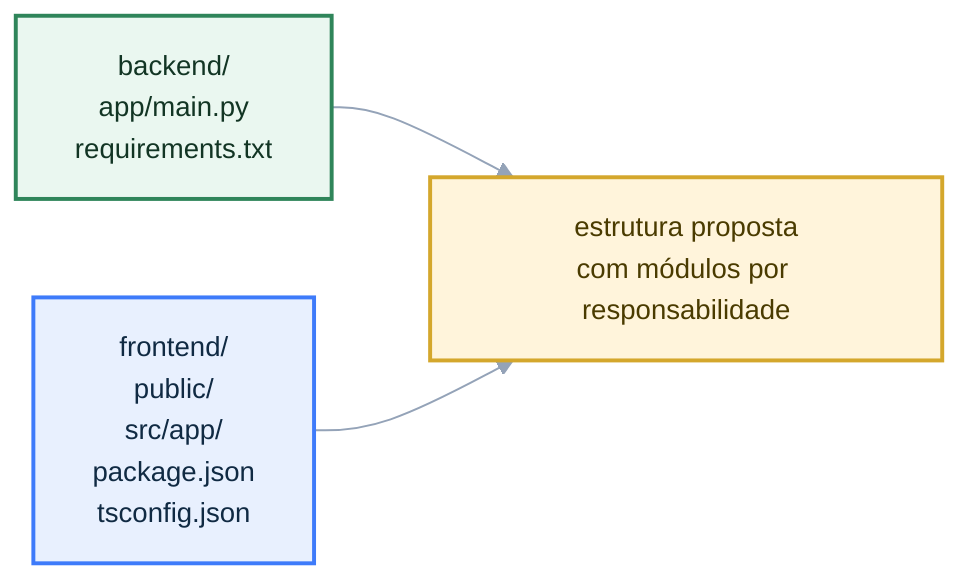

# Estrutura de Pastas

Esta página mapeia a organização proposta para o repositório e orienta como novas features devem ser encaixadas ao longo da evolução do projeto.

## Estrutura Proposta

O tree abaixo representa a organização recomendada para a evolução do projeto.

```text
.
|-- backend/
|   |-- app/
|   |   |-- api/                # Endpoints e roteadores FastAPI
|   |   |-- core/               # Configuração, segurança e dependências globais
|   |   |-- db/                 # Conexão, repositórios e integrações de persistência
|   |   |-- models/             # Schemas Pydantic e contratos da API
|   |   |-- services/           # Regras de negócio e casos de uso
|   |   `-- main.py             # Ponto de entrada da API
|   `-- requirements.txt        # Dependências Python
|-- frontend/
|   |-- public/                 # Assets públicos
|   |-- src/
|   |   |-- app/                # App Router, layouts e páginas
|   |   |-- components/         # Componentes reutilizáveis
|   |   |-- lib/                # Clientes HTTP, helpers e utilitários
|   |   `-- types/              # Tipagens compartilhadas
|   |-- package.json            # Scripts e dependências Node.js
|   `-- tsconfig.json           # Configuração TypeScript
|-- docs/
|   |-- architecture/           # Diagramas, decisões e estrutura técnica
|   `-- index.md                # Entrada principal da documentação
`-- mkdocs.yml                  # Navegação e configuração do site
```

## Referência de Implementação Atual

O estado atual implementado no repositório ainda é mais enxuto:



```text
backend/
|-- app/
|   `-- main.py
`-- requirements.txt

frontend/
|-- public/
|-- src/
|   `-- app/
|       |-- favicon.ico
|       |-- globals.css
|       |-- layout.tsx
|       `-- page.tsx
|-- package.json
`-- tsconfig.json
```

## Leitura do Tree

- a estrutura apresentada funciona como referência principal para novas implementações;
- novas features devem priorizar essas pastas antes de criar novas convenções;
- quando uma pasta nova surgir, ela deve reforçar a separação entre interface, aplicação e persistência.

## Regras de Organização

- Cada camada deve ter responsabilidade única e nomes previsíveis.
- Regras de negócio não devem ficar misturadas com detalhes de transporte HTTP.
- Componentes de UI não devem encapsular chamadas de rede complexas quando elas puderem viver em `lib/`.
- Novos módulos devem ser adicionados seguindo a pasta de responsabilidade antes de criar novas convenções.

## Exemplo de Evolução de Feature

Uma feature backend simples tende a evoluir na seguinte sequência:

1. rota em `backend/app/api/`;
2. contrato em `backend/app/models/`, quando necessário;
3. orquestração em `backend/app/services/`;
4. acesso a dados em `backend/app/db/`.

## Exemplo de Crescimento no Backend

```py
# backend/app/api/health.py
from fastapi import APIRouter

router = APIRouter(prefix="/health", tags=["health"])


@router.get("")
def read_health():
    return {"status": "ok"}
```

```py
# backend/app/main.py
from fastapi import FastAPI

from app.api.health import router as health_router

app = FastAPI()
app.include_router(health_router)
```

## Exemplo de Evolução no Frontend

```ts
// frontend/src/lib/api/health.ts
export async function getHealth() {
  const response = await fetch("http://localhost:8000/health", {
    cache: "no-store",
  });

  return response.json() as Promise<{ status: string }>;
}
```

```tsx
// frontend/src/app/page.tsx
import { getHealth } from "@/lib/api/health";

export default async function Home() {
  const health = await getHealth();

  return <pre>{JSON.stringify(health, null, 2)}</pre>;
}
```
