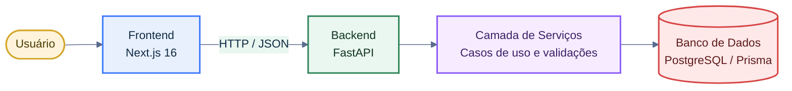
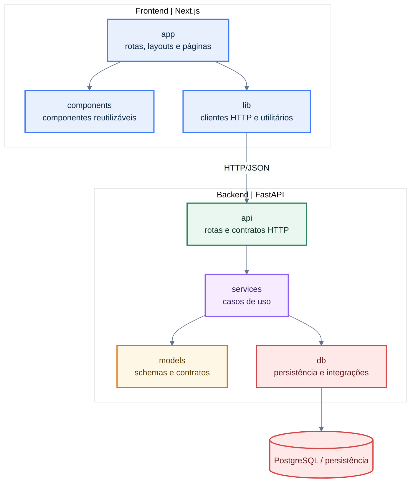
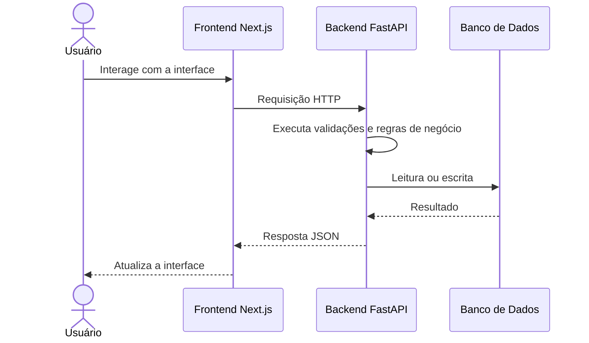

# Arquitetura

Esta seção documenta a arquitetura proposta para o sistema, com foco em reduzir o tempo de onboarding, evitar organização ad hoc de pastas e registrar uma base técnica comum para as próximas implementações.

## Leitura Rápida

Hoje o sistema possui duas aplicações principais:

- `frontend`: interface web em Next.js, responsável pela experiência do usuário.
- `backend`: API em FastAPI, responsável por regras de negócio, orquestração e acesso a dados.

Arquiteturalmente, o projeto adota separação por camadas, contratos claros entre frontend e backend e crescimento incremental de módulos conforme surgem novos casos de uso.

Observação: parte dos módulos descritos nesta página representa a organização arquitetural recomendada para a evolução de curto prazo do projeto.

## Princípios Arquiteturais

- **Separação de responsabilidades**: interface, aplicação e persistência não devem se confundir.
- **Baixo acoplamento**: regras de negócio não devem depender diretamente de detalhes de framework ou infraestrutura.
- **Crescimento guiado por estrutura**: novas features devem reforçar o padrão do repositório, não criar convenções paralelas.
- **Clareza para onboarding**: a arquitetura precisa ser legível por quem está entrando no projeto.

## Contexto do Sistema

O diagrama abaixo mostra a visão de contexto do sistema, destacando quem usa a aplicação e quais blocos técnicos participam do fluxo principal.

## Visão de Containers

O diagrama a seguir apresenta a organização arquitetural proposta para o repositório.

## Fluxo Principal de Requisição

O fluxo abaixo descreve a jornada principal de requisição entre as camadas da arquitetura proposta.

O fluxo acima resume a jornada esperada para as próximas features:

1. o usuário interage com uma página do frontend;
2. a página delega chamadas de integração para `lib/`;
3. o backend recebe a requisição na camada `api/`;
4. a regra de negócio é executada em `services/`;
5. a persistência acontece em `db/`;
6. a resposta retorna ao frontend com contrato explícito.

## Responsabilidades por Camada

| Camada | Responsabilidade |
| --- | --- |
| `frontend/src/app` | Rotas, páginas e composição da UI |
| `frontend/src/components` | Componentes reutilizáveis e padrões visuais |
| `frontend/src/lib` | Clientes HTTP, helpers e adaptadores de integração |
| `backend/app/api` | Endpoints, contratos HTTP e roteamento |
| `backend/app/services` | Casos de uso e regras de negócio |
| `backend/app/models` | Schemas Pydantic e contratos internos |
| `backend/app/db` | Integração com persistência e ORM |

## Diretrizes de Evolução

Para as próximas entregas, a documentação assume a seguinte direção:

- cada feature deve nascer com rota, caso de uso e contrato bem definidos;
- o frontend deve mover integrações para `src/lib/` e concentrar composição visual em `components/`;
- o backend deve evoluir para uma service layer explícita;
- o acesso a dados deve permanecer encapsulado em uma fronteira própria.

## Uso da Documentação

Esta seção serve como referência para:

- entender rapidamente onde uma nova feature deve ser implementada;
- decidir em qual camada um novo trecho de código pertence;
- revisar se uma mudança está respeitando a separação arquitetural do projeto;
- alinhar o repositório antes de abrir PRs maiores.

## Referência Visual Existente

O repositório já possui uma imagem de contexto em [c4_system_context.jpeg](c4_system_context.jpeg), mas os diagramas Mermaid desta seção passam a ser a referência principal por serem versionáveis e mais fáceis de manter junto da documentação.
