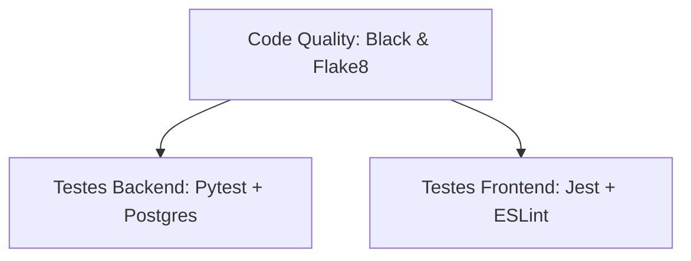

# Setup da Integração Contínua (CI) e Qualidade de Código

## Por que este documento existe

Este documento descreve a configuração e o funcionamento do pipeline de Integração Contínua (CI) do **CrivoAI**. Ele serve como um guia para que os desenvolvedores entendam quais validações rodam a cada Pull Request e como reproduzir essas checagens em seus ambientes de desenvolvimento locais.

## Como se relaciona com o projeto

A garantia de qualidade no CrivoAI baseia-se na execução automática de linters, testes unitários e testes de integração em todas as branches que almejam integração na branch `dev` ou `main`. O CI atua como a barreira automatizada que garante a estabilidade do sistema à medida que novas regras de negócio e integrações de IA são implementadas.

---

## Fluxo do Pipeline do GitHub Actions

O workflow está configurado em `.github/workflows/main.yml` e dispara automaticamente sob duas condições:

1. Em qualquer **Pull Request** direcionado às branches `main` e `dev`.
2. Em qualquer **Push** direto nas branches `main` e `dev`.

O pipeline é composto por 3 estágios principais estruturados em Jobs interdependentes:



### 1. Code Quality (Qualidade de Código Backend)

Executa a validação de formatação e estilo no código Python do backend.

* **Black:** Garante que o código do backend segue o estilo estrito do Black.
* **Flake8:** Valida regras de estilo PEP 8 adicionais, impondo o limite máximo de 88 caracteres por linha.

### 2. Testes Backend

Executa tanto os testes unitários quanto os de integração do backend.

* Inicializa um serviço Dockerizado do banco PostgreSQL (`postgres:16-alpine`) em tempo de execução para os testes de integração.
* Configura e gera o cliente Prisma (`prisma generate` e `prisma db push`).
* Roda a suíte completa de testes com o `pytest` (unitários e integrados) com cobertura configurada.

### 3. Testes Frontend

Executa linters e a suíte de testes do frontend.

* **ESLint:** Roda a análise de estilo e boas práticas de TypeScript/React.
* **Jest:** Executa os testes unitários e de componentes do Next.js coletando cobertura de código.

---

## Como Executar as Validações Localmente

Antes de abrir um Pull Request, os desenvolvedores devem rodar as ferramentas de linting e testes em suas máquinas locais para evitar falhas no pipeline do GitHub.

### 1. Validando o Backend

Acesse o diretório do backend:

```bash
cd backend
```

**Verificação de Estilo (Black & Flake8):**

```bash
# Executa a checagem do Black
black --check .

# Executa o linter Flake8
flake8 . --max-line-length=88 --extend-ignore=E501,W503
```

**Execução dos Testes e Geração de Cobertura:**

```bash
# Executa todos os testes locais com o relatório de cobertura no terminal
pytest --cov=app --cov-report=term-missing

# Executa os testes gerando os relatórios em HTML (pasta htmlcov/) e LCOV (arquivo coverage.lcov)
pytest --cov=app --cov-report=html --cov-report=lcov --cov-report=term-missing
```

### 2. Validando o Frontend

Acesse o diretório do frontend:

```bash
cd frontend
```

**Verificação de Lint:**

```bash
npm run lint
```

**Execução de Testes locais:**

```bash
# Executa a suíte de testes
npm run test

# Executa os testes coletando cobertura de código
npm run test:coverage
```

---

## Integração Futura Planejada (SonarCloud)

A integração com o **SonarQube/SonarCloud** está planejada e mapeada para o projeto, aguardando a configuração dos tokens organizacionais (`SONAR_TOKEN`) sob a organização `unb-mds` no GitHub.

Quando ativado, o fluxo passará a coletar automaticamente os relatórios de cobertura do pytest (`coverage.xml`) e do Jest (`lcov.info`) e enviará para o painel de análise estática de vulnerabilidades e Quality Gate do SonarCloud.
