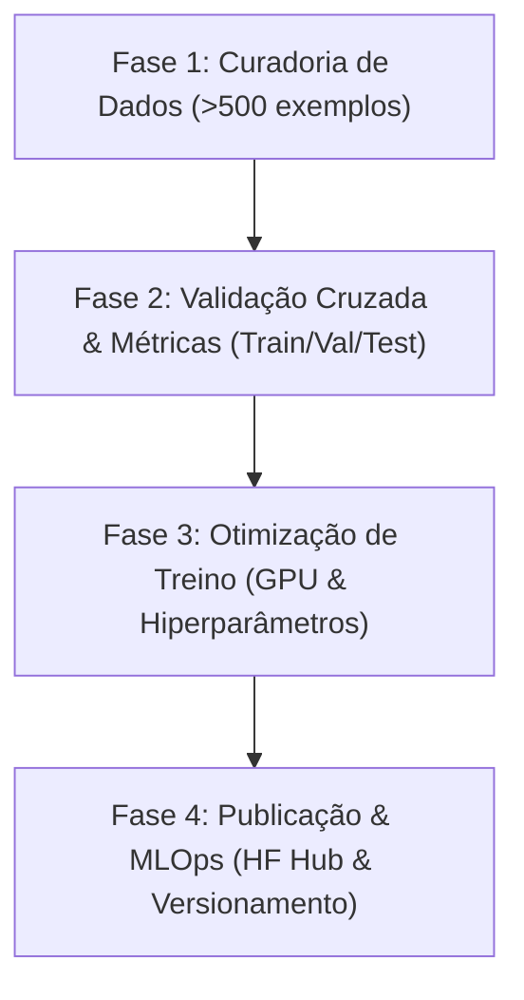

# Plano de Expansão de Treinamento - LegalBERT-pt

## Por que este documento existe?

Este documento serve como um guia técnico estratégico e operacional para orientar desenvolvedores e futuros agentes de IA na evolução do motor de Processamento de Linguagem Natural (NLP) do **CrivoAI**. 

## Qual problema ele resolve?

Atualmente, o classificador multi-label baseado no modelo `raquelsilveira/legalbertpt_fp` utiliza um dataset minimalista de **10 exemplos** ([dataset_laws.json](file:///home/pedro/2026-1-Squad07/backend/data/dataset_laws.json)) para realizar o treinamento da cabeça linear de classificação. Embora essa estrutura valide com sucesso todo o pipeline de software e a integração backend/frontend (carregamento sob demanda, persistência e listagem no catálogo), o modelo carece de generalização técnica e acurácia estatística para o uso em produção real. 

Este plano estabelece as fases necessárias para expandir a base de conhecimento, implementar métricas rigorosas de ML e calibrar o modelo para a classificação confiável das 4 categorias de problemas legislativos (`ambiguidade`, `vagueza`, `falta_referencia`, `inconsistencia`).

## Relação com o Projeto

O motor de classificação de NLP é o núcleo de inteligência do CrivoAI (Issue #86). O sucesso do produto depende de fornecer aos assessores legislativos e cidadãos uma avaliação confiável da qualidade técnica de leis e proposições. Este plano conecta o código de infraestrutura do backend com as melhores práticas de MLOps para garantir a evolução contínua da inteligência do sistema.

---

## Plano de Ação para Expansão do Treinamento



### Fase 1: Coleta e Curadoria de Dados

Para atingir uma acurácia e cobertura aceitáveis, o dataset deve ser expandido de 10 para **pelo menos 500 exemplos rotulados** (idealmente mais de 1000).

1. **Fontes de Dados**:
   - Extrair proposições legislativas reais da API da Câmara dos Deputados e do Senado Federal.
   - Selecionar textos históricos que sofreram vetos por inconstitucionalidade, redação vaga ou falta de referências técnicas.
2. **Formato dos Dados**:
   - Manter o padrão do arquivo `backend/data/dataset_laws.json` para retrocompatibilidade:
     ```json
     {
       "id": "pl-identificador-unico",
       "title": "Título da Lei",
       "description": "Breve descrição",
       "lawNumber": "PL XXX/2026",
       "jurisdiction": "Federal/Nacional",
       "publicationDate": "2026-07-01T00:00:00Z",
       "text": "Texto integral ou dispositivo a ser analisado...",
       "labels": {
         "ambiguidade": 1.0,
         "vagueza": 0.0,
         "falta_referencia": 0.0,
         "inconsistencia": 0.0
       }
     }
     ```
3. **Diretrizes de Anotação**:
   - Cada exemplo deve possuir anotação binária (`1.0` para presença, `0.0` para ausência) incondicionalmente em cada uma das 4 categorias.
   - Garantir a revisão por pares das anotações para evitar viés.

### Fase 2: Implementação de Validação Cruzada e Métricas de ML

O script [train_classifier.py](file:///home/pedro/2026-1-Squad07/backend/scripts/train_classifier.py) atual treina diretamente com todo o dataset, sem validação independente. É necessário reestruturá-lo:

1. **Divisão de Dataset**:
   - Implementar a divisão do dataset JSON em conjuntos de **Treino (80%)**, **Validação (10%)** e **Teste (10%)** usando amostragem estratificada (por exemplo, com `train_test_split` do `scikit-learn`).
2. **Função de Computação de Métricas**:
   - Adicionar uma função de avaliação no `Trainer` do Hugging Face para computar métricas reais a cada época:
     - **F1-Score Macro e Micro** (essencial para classificação multi-label).
     - **Precision** e **Recall** individuais por categoria.
3. **Tratamento de Classes Desbalanceadas**:
   - Como algumas falhas legislativas (como `inconsistencia`) podem ser mais raras, calcular e injetar pesos de classe (class weights) na função de perda (Loss Function) `BCEWithLogitsLoss` para balancear a influência de exemplos minoritários.

### Fase 3: Otimização de Hiperparâmetros e Hardware

O script atual foi projetado para rodar em CPU (`use_cpu=True`) e batch size mínimo para ser leve durante os testes locais. Para o treino expandido:

1. **Suporte Automático a GPU (CUDA)**:
   - Modificar a configuração de `TrainingArguments` para remover o travamento em CPU (`use_cpu=True`) e permitir a detecção automática de CUDA:
     ```python
     device = "cuda" if torch.cuda.is_available() else "cpu"
     ```
2. **Hiperparâmetros Sugeridos**:
   - `learning_rate`: Iniciar testes entre `2e-5` e `5e-5`.
   - `per_device_train_batch_size`: Aumentar para `8` ou `16` (se utilizando GPU).
   - `num_train_epochs`: Aumentar para `5` a `10` épocas.
   - `early_stopping_patience`: Implementar `EarlyStoppingCallback` do Hugging Face monitorando o loss de validação para interromper o treino em caso de overfitting.

### Fase 4: MLOps, Versionamento e Hugging Face Hub

1. **Registro do Modelo**:
   - Utilizar o script [upload_model.py](file:///home/pedro/2026-1-Squad07/backend/scripts/upload_model.py) para versionar o modelo no Hugging Face Hub a cada evolução relevante.
   - Configurar o pipeline do Github Actions (CI) para realizar testes automatizados contra a versão remota estável utilizando a variável de ambiente `MODEL_NAME`.
2. **Versionamento do Dataset**:
   - Manter o dataset `dataset_laws.json` atualizado no repositório, ou utilizar ferramentas como DVC (Data Version Control) se a base de dados escalar além de dezenas de megabytes.

---

## Como Validar as Alterações

Qualquer evolução de treinamento feita por um desenvolvedor ou agente de IA deve ser validada seguindo os seguintes passos:

1. **Métricas Offline**:
   - O treinamento expandido deve gerar logs detalhados de F1-Score no final da execução. A meta inicial sugerida de aceitação é de **F1-Score Macro >= 0.75** no conjunto de testes independente.
2. **Testes Unitários e Linter**:
   - Executar os testes locais e garantir que nenhuma regressão de software ocorreu:
     ```bash
     cd backend
     .venv/bin/pytest
     .venv/bin/black --check .
     .venv/bin/flake8 app tests scripts
     ```
3. **Teste de Inferência Manual**:
   - Rodar o validador rápido de inferência para checar as predições geradas pelo novo modelo local em textos conhecidos:
     ```bash
     .venv/bin/python scripts/test_classifier_local.py
     ```
4. **Atualização do Catálogo**:
   - Executar a ingestão no PostgreSQL para testar o comportamento de ponta a ponta na API:
     ```bash
     .venv/bin/python scripts/ingest_catalog.py
     ```
