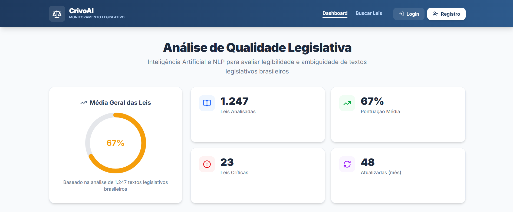

# Protótipo de Alta Fidelidade (Figma)

Esta seção documenta a interface do usuário (UI) e a experiência do usuário (UX) planejadas para o projeto **CrivoAI**. O protótipo serve como o guia visual oficial para a componentização do frontend.

## Links de Acesso

Para visualizar e interagir com o design do sistema, utilize os acessos oficiais abaixo:

* **[Modo de Visualização (Design Completo)](https://www.figma.com/design/kRHZNwrYNd6eAsXkTj9822/CrivoAi_Hi_fidelity_prototype?node-id=0-1&t=KAyvU6ndHKre9HwP-1)**: Utilize este link para inspecionar componentes, verificar espaçamentos, cores e tipografia para a implementação no Next.js.
* **[Modo de Demonstração (Protótipo Interativo)](https://www.figma.com/make/dyXjTsHGOboz8OK90JZVYo/CrivoAI_hi_fidelity_pototype_figma?code-node-id=0-9&p=f&t=eisk4blj6Pp2lSX4-0&fullscreen=1)**: Utilize este link para experimentar o fluxo de navegação e as transições simuladas em tela cheia.

---

## Diretrizes para o Desenvolvimento do Frontend

Conforme definido nos [Padrões de Projeto](../architecture/design-patterns.md), a implementação das telas deve respeitar estritamente a arquitetura de crescimento incremental do frontend:

1.  **Mapeamento de Componentes**: Identifique elementos repetitivos no Figma e crie-os isoladamente na pasta `frontend/src/components/`.
2.  **Estrutura de Páginas**: O fluxo de telas validado no protótipo interativo deve refletir diretamente na organização de rotas dentro de `frontend/src/app/`.
3.  **Contratos de Dados**: Elementos dinâmicos exibidos nas telas devem ter suas tipagens mapeadas preventivamente em `frontend/src/types/`.

---

---

## Visualização do Projeto

Se o seu navegador bloquear a incorporação direta do Figma, você pode conferir o design principal abaixo ou utilizar os links de acesso no topo da página.

Para inspecionar propriedades de CSS, tamanhos de fontes e paddings, utilize o **[Modo de Visualização (Design Completo)](https://www.figma.com/design/kRHZNwrYNd6eAsXkTj9822/CrivoAi_Hi_fidelity_prototype?node-id=0-1&t=KAyvU6ndHKre9HwP-1)** diretamente na plataforma do Figma.

Se o seu navegador permitir cookies de terceiros, você pode interagir com o Figma diretamente por aqui:

<iframe style="border: 1px solid rgba(0, 0, 0, 0.1);" width="100%" height="600" src="https://www.figma.com/embed?embed_host=share&url=https%3A%2F%2Fwww.figma.com%2Fdesign%2FkRHZNwrYNd6eAsXkTj9822%2FCrivoAi_Hi_fidelity_prototype%3Fnode-id%3D0-1" allowfullscreen></iframe>