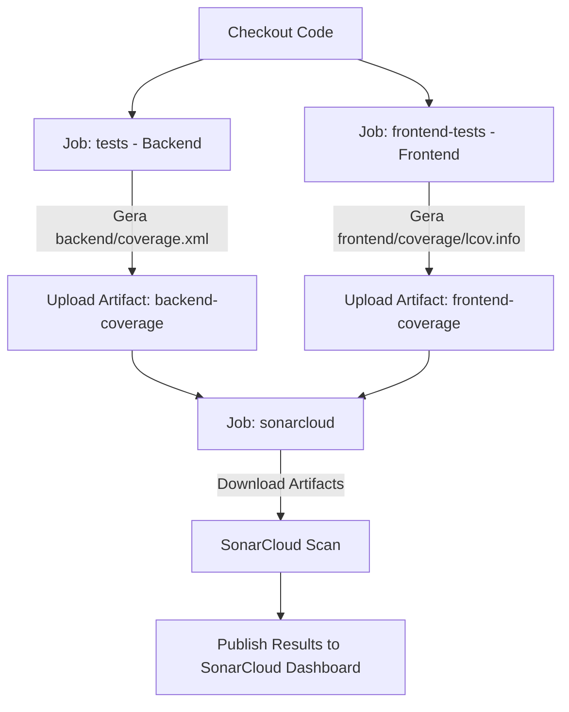

# Implementation Plan: Integração com SonarCloud — R2

**Feature**: Integração com SonarCloud (Análise Estática e Cobertura)
**ID da Spec**: `specs/006-sonarcloud-integration`

## Abordagem Técnica

A estratégia técnica consiste em configurar a análise estática em modo monorepo, de modo que os relatórios reais de cobertura de testes gerados pelo Jest (frontend) e Pytest (backend) sejam consolidados e enviados ao SonarCloud ao final do pipeline.



---

## 1. Modificações de Arquivos e Novas Implementações

### A. Criação do arquivo `sonar-project.properties` (Raiz do Projeto)

Criar o arquivo de configurações na raiz do repositório, mapeando os escopos de código fonte, testes e caminhos de cobertura.

```properties
# Metadados do Projeto
sonar.organization=unb-mds
sonar.projectKey=unb-mds_2026-1-Squad07
sonar.projectName=2026-1-Squad07

# Escopo de Código e Testes
sonar.sources=backend/app,frontend/src
sonar.tests=backend/tests,frontend/src/app/profile/__tests__,frontend/src/app/law/[id]/page.test.tsx,frontend/src/components/__tests__,frontend/src/__tests__
sonar.test.inclusions=**/*.test.ts,**/*.test.tsx,**/test_*.py

# Padrões de Exclusão de Análise
sonar.exclusions=node_modules/**,frontend/node_modules/**,.venv/**,backend/prisma/**,frontend/.next/**,frontend/out/**,backend/htmlcov/**,backend/.pytest_cache/**,frontend/coverage/**,backend/tests/**

# Caminhos de Relatórios de Cobertura de Testes
sonar.python.coverage.reportPaths=backend/coverage.xml
sonar.javascript.lcov.reportPaths=frontend/coverage/lcov.info

# Configuração de Encoding
sonar.sourceEncoding=UTF-8
```

### B. Atualização do Workflow do CI/CD (`.github/workflows/main.yml`)

Ajustar o pipeline para:

1. Gerar cobertura do backend em formato XML (`--cov-report=xml` no pytest).
2. Salvar relatórios de cobertura gerados como artefatos temporários do workflow.
3. Baixar os artefatos de cobertura no novo job `sonarcloud`.
4. Executar a Action oficial do SonarSource.

```yaml
# Trecho da atualização no main.yml:

  tests:
    # ... configurações existentes ...
    steps:
      # ... passos existentes ...
      - name: Rodar testes com coverage
        run: |
          pytest backend/tests/unit/ -v --tb=short \
            --cov=app --cov-report=xml --cov-report=lcov --cov-fail-under=90
      - name: Upload Backend Coverage
        uses: actions/upload-artifact@v4
        with:
          name: backend-coverage
          path: backend/coverage.xml

  frontend-tests:
    # ... configurações existentes ...
    steps:
      # ... passos existentes ...
      - name: Rodar testes com coverage
        run: npm run test:coverage
        working-directory: frontend
      - name: Upload Frontend Coverage
        uses: actions/upload-artifact@v4
        with:
          name: frontend-coverage
          path: frontend/coverage/lcov.info

  sonarcloud:
    name: SonarCloud Scan
    runs-on: ubuntu-latest
    needs: [tests, frontend-tests]
    steps:
      - uses: actions/checkout@v4
        with:
          fetch-depth: 0  # Desabilita shallow clone para análise precisa de histórico de commits/autores
      - name: Download Backend Coverage
        uses: actions/download-artifact@v4
        with:
          name: backend-coverage
          path: backend/
      - name: Download Frontend Coverage
        uses: actions/download-artifact@v4
        with:
          name: frontend-coverage
          path: frontend/coverage/
      - name: SonarCloud Scan
        uses: sonarsource/sonarcloud-github-action@master
        env:
          GITHUB_TOKEN: ${{ secrets.GITHUB_TOKEN }}  # Padrão do GitHub
          SONAR_TOKEN: ${{ secrets.SONAR_TOKEN }}    # Configurado nas secrets do repositório
```

---

## 2. Configurações Administrativas do GitHub (Secrets)

Para viabilizar a autenticação do pipeline com a API do SonarCloud, o líder técnico/administrador do repositório deve realizar o seguinte passo nas configurações do GitHub:

1. Acessar o repositório no GitHub.
2. Navegar em: **Settings** ➔ **Secrets and variables** ➔ **Actions**.
3. Clicar em **New repository secret**.
4. Definir o nome como `SONAR_TOKEN`.
5. Colar a chave gerada no painel do SonarCloud (My Account ➔ Security ➔ Generate Tokens).
